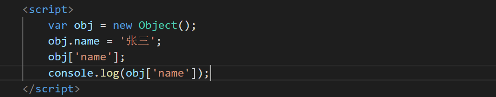
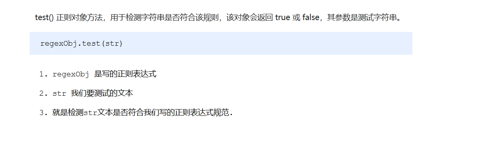

### js基础

###### 浏览器的组成

浏览器由渲染引擎和js引擎所组成


###### js的组成


###### 算数运算符


以上是对==中会转型的理解

##### 对象

###### 创建对象的方法

三种

1. 利用字面量创建对象

   ```
           var obj = {
               name: '张三',
               age: 10
           }
   
           console.log(obj.age);
   ```

2. 利用new Object创建对象

   ```
           var obj = new Object();
           obj.name = '张三';
   
           console.log(obj.name);
   ```

3. 利用构造函数创建对象

   ```
           function Obj(name, age) {
               this.name = name;
               this.age = age;
           }
   
           var zhangSan = new Obj('张三', 10);
   
           console.log(zhangSan.age);
   ```

###### 怎样为对象添加属性

```
        var obj = new Object();
        obj.name = '张三';

        console.log(obj.name);
```

###### 对象的属性调用、对象的方法调用

对象里面的属性调用 : 对象.属性名 ，这个小点 . 就理解为“ 的 ”  

对象里面属性的另一种调用方式 : 对象[‘属性名’]，注意方括号里面的属性必须加引号，我们后面会用    



对象里面的方法调用：对象.方法名() ，注意这个方法名字后面一定加括号 

###### js预解析

在当前作用域下, JS 代码执行之前，浏览器会默认把带有 var 和 function 声明的变量在内存中进行提前声明或者定义。


结果是undefined。因为num变量会提前声明。相当于执行如下代码：


执行结果是想不到把。原因是函数声明会提前。相当于执行如下代码：


#### js内置对象

内置对象就是指 JS 语言自带的一些对象，这些对象供开发者使用，并提供了一些常用的或是最基本而必要的功能（属性和方法）
内置对象最大的优点就是帮助我们快速开发
 JavaScript 提供了多个内置对象：Math、 Date 、Array、String等

##### Math 对象

Math 对象不是构造函数，它具有数学常数和函数的属性和方法。跟数学相关的运算（求绝对值，取整、最大值等）可以使用 Math 中的成员。


###### 随机数方法 random()


##### 日期对象

###### 获取当前时间对象

var now = new Date();

 获取当前时间必须实例化

###### 日期格式化


###### 获取时间毫秒值

首先要得到日期对象

var date = new Date();

有以下几种方法：

1.date.valueOf()

2.date.getTime()

3.var now = + new Date();

4.var now = Date.now();HTML5中提供的方法，有兼容性问题

###### 通过日期对象和时间毫秒值得到时分秒

```
通过日期对象
var h = now.getHours();
 var m = now.getMinutes();
 var s = now.getSeconds();
```

```
通过时间毫秒值
 d = parseInt(总秒数/ 60/60 /24);    //  计算天数
 h = parseInt(总秒数/ 60/60 %24)   //   计算小时
 m = parseInt(总秒数 /60 %60 );     //   计算分数
 s = parseInt(总秒数%60);               //   计算当前秒数 
```

##### 字符串对象

######  字符串拼接

是什么？怎么用？

 多个字符串之间可以使用 + 进行拼接，其拼接方式为 字符串 + 任何类型 = 拼接之后的新字符串
 拼接前会把与字符串相加的任何类型转成字符串，再拼接成一个新的字符串

######  字符串拼接加强

// console.log('pink老师age岁啦');       // 这样不行哦
console.log('pink老师' + age);          // pink老师18
console.log('pink老师' + age + '岁啦');  // pink老师18岁啦

###### 字符串分割

###### 根据字符返回位置


###### 根据位置返回字符


###### 替换字符


###### spilt()方法


###### 转换大小写


##### 数组对象

###### 数组的创建方法

1.利用  new 创建数组

var arr = new Array();   // 创建一个新的空数组

2.利用数组字面量创建数组

var  数组名 = ['小白','小黑','大黄','瑞奇'];

###### 添加删除数组元素的方法


###### 数组排序


###### 数组索引方法


#### 数据类型转换

###### 数字型转换为字符串


###### 字符串转换为数字型


###### 数组转换为字符串


###### 判断对象是否属于某种类型

typeof 可用来获取检测变量的数据类型

###### 保留两位小数

toFixed(2)

###### undefined和null的区别


### ES6

###### 什么是 ES6 ?


##### 关键字

###### let


###### const


###### let、const、var 的区别


##### 箭头函数


##### 正则表达式

###### 什么是正则表达式


###### 正则表达式在 JavaScript 中的使用


###### 测试正则表达式 test



##### 正则表达式的组成


###### 边界符


###### 字符类


###### 量词符


###### 预定义类


###### 正则表达式中的替换


* 只能替换第一个

###### 正则表达式参数


######  在线测试工具

https://c.runoob.com/

##### 类 class

###### 创建类


###### 类 constructor 构造函数


###### 类添加方法


###### 继承


###### super 关键字


