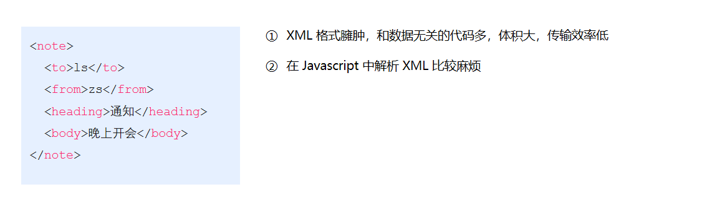
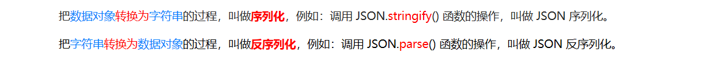
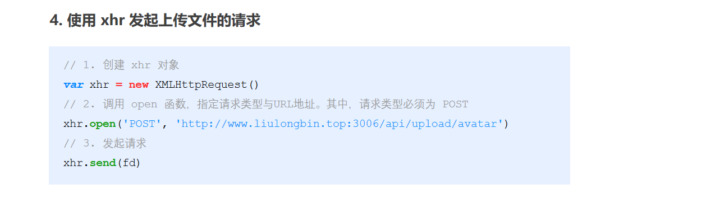

vscode快捷键

SHIFT + ALT + 单击：在选定的每行末尾插入光标

CTRL+L:选中当前行

CTRL+F2:选择所有出现的当前单词

##### 常识

###### lib文件夹

lib是library的缩写，意思是库文件

###### 网页版设计图

网页版设计图如果老是变换成百分比就长按alt切换

###### 框架和插件的区别

框架，顾名思义就是一套架构，它会基于自身的特点向用户提供一套较为完整的解决方案。框架的控制权在框架本身，使用者要按照框架所规定的某种规范进行开发。

插件一般是为了解决某个问题而专门存在，其功能单一，并且比较小。

###### ip地址、域名和url的区别


* 总结：IP地址=域名=计算机的身份证；url是你这台计算机上资源存放的具体位置，它的前半段是ip地址，后半段是具体的地址

### web标准

###### 为什么要web标准？

不同浏览器的渲染引擎不同，对于相同代码解析的效果会存在差异。如果用户想看一个网页，结果用不同浏览器打开效果不同，用户体验极差！

###### 什么是web标准？

让不同的浏览器按照相同的标准显示结果，让展示的效果统一！

###### Web标准的构成


### [什么是W3C标准](https://www.cnblogs.com/71yishen/articles/14179131.html)

前言：我们平时说的W3C，其实是World Wide Web Consortium的缩写，中文是W3C组织或者万维网联盟，W3C这个组织做什么的呢？很简单，就是出网页标准的。那么由W3C组织出的标准就被称为W3C标准，那么符合W3C标准的页面就是标准页面了，好，问题来了~

什么是W3C标准？

　　【注意】下面对W3C标准的解释，需要理解一下，因为在很多Web前端开发工程师面试的时候会遇到这方面的问题，很多企业在面试一些Web前端技术人员的时候，认为如果连什么是W3C都不知道，那做出来的页面肯定就不能够符合W3C标准，所以要求大家留意下！

　　W3C标准不是一个标准，而是一系列标准的集合，包含三部分的标准：结构标准、表现标准和动作标准。与结构标准对应的代表语言是xHTML，与表现标准对应的代表语言是CSS，与动作标准对应的代表语言是JavaScript。

　　当我们将一个成品的网页设计制作成一个静态页面的时候，就要符合前面两种标准，结构标准和表现标准，那么制作出来的页面就是标准页面，用他们相对应的语言来描述这种制作标准页面的技术我们就称之为“xHTML+CSS”！

​     【总结】知识一、知识二、知识三是大家必须知道的，知道了这些无论去面试还是和其他人沟通，都会让对方感觉你这个人很专业，对技术理解很透彻！


\1. !DOCTYPE声明

\2. 定义语言编码

\3. Javascript定义 

Js必须要用<script language="javascript" type="text/javascript">来开头定义，而不是原来的<script language=javascript>或干脆直接<script>

\4. css定义

CSS必须要用<style type="text/css">开头来定义，而不是原来的直接<style>

该加单位加单位，该有分号有分号

\5. 不要在注释内容中使用“--”

“--”只能发生在XHTML注释的开头和结束，也就是说，在内容中它们不再有效。
例如下面的代码是无效的：<!--这里是注释-----------这里是注释-->
正确的应用等号或者空格替换内部的虚线。<!--这里是注释============这里是注释-->

\6. 所有标签的元素和属性的名字都必须使用小写
与HTML不一样，XHTML对大小写是敏感的，<title>和<TITLE>是不同的标签。XHTML要求所有的标签和属性的名字都必须使用小写。例如：<BODY>必须写成<body>。大小写夹杂也是不被认可的，通常dreamweaver自动生成的属性名字"onMouseOver"也必须修改成"onmouseover"。

\7. 所有的属性必须用引号""括起来
在HTML中，你可以不需要给属性值加引号，但是在XHTML中，它们必须被加引号。
例如：<height=80>必须修改为：<height="80">。
特殊情况，你需要在属性值里使用双引号，你可以用"，单引号可以使用&apos;，例如：<alt="say&apos;hello&apos;">

\8. 把所有<和&特殊符号用编码表示
任何小于号（<），不是标签的一部分，都必须被编码为 &lt;
任何大于号（>），不是标签的一部分，都必须被编码为 &gt;
任何与号（&），不是实体的一部分的，都必须被编码为 &amp; 

\9. 给所有属性赋一个值
XHTML规定所有属性都必须有一个值，没有值的就重复本身。例如： 
<td nowrap><input type="checkbox" name="shirt" value="medium" checked>必须修改为：
<td nowrap="nowrap"><input type="checkbox" name="shirt" value="medium" checked="checked" />

\10. 所有的标记都必须要有一个相应的结束标记
以前在HTML中，你可以打开许多标签，例如<p>和<li>而不一定写对应的</p>和</li>来关闭它们。但在XHTML中这是不合法的。XHTML要求有严谨的结构，所有标签必须关闭。如果是单独不成对的标签，在标签最后加一个"/"来关闭它。 

\11. 所有的标记都必须合理嵌套 
同样因为XHTML要求有严谨的结构，因此所有的嵌套都必须按顺序，以前我们这样写的代码： 

<p><b></p></b>必须修改为：<p><b></b></p> 

\12. 图片添加有意义的alt属性
例如：
尽可能的让作为内容的图片都带有属于自己的alt属性。
同理：添加文字链接的title属性。
<a href="#" target="_blank" title="新闻新闻新闻新闻">新闻新闻…</a>，在一些限定字数的内容展示尤为重要，帮助显示不完成的内容显示完整，而不用考虑页面会因此而撑大。

\13. 在form表单中增加lable，以增加用户友好度 

### Html5

[HTML5 简介 (w3school.com.cn)](https://www.w3school.com.cn/html/html5_intro.asp)

### Html

###### 标题标签h

###### 段落标签p

###### 水平线标签hr

###### 换行标签br

###### 文本格式化标签(标签语义化)

```
<strong></strong>
<i></i>倾斜
<em></em>强调（strong的语气更强）
 <del></del>删除线
都是行内标签，不然怎么叫文本标签呢
```

###### img标签

###### audio标签

###### video标签

###### 无序列表

ul>li

###### 有序列表

ol>li

###### 自定义列表

```
<dl>
<dt></dt>
<dd></dd>
</dl>
```

###### 表格

```
<table>
        <th><tr><td></td></tr></th>
        <tbody>
            <tr><td></td></tr>
        </tbody>
    </table>
```

#### 表单标签

就是嵌套在表单内部的标签，主要和表单form一起使用，所以叫表单标签

##### input标签

###### 文本框


###### 密码框

。

###### 单选框


* 有相同name属性值的单选框为一组，一组只能同时有一个被选中

  

###### 多选框


多选框的状态属性：checked，this.checked=true//选中，this.checked=false//未选中

###### 文件选择框


###### 表单按钮


##### button标签


###### button标签和input标签中的表单按钮的区别

我觉得是完全一样的，随便用哪种

##### 下拉菜单


##### 文本域标签


##### label标签


#### div标签

#### span标签

#### 字符实体

###### 空格

&nbsp ;

###### 大于号

& gt;

###### 小于号

& lt;

#### li标签

如果不给宽高的话，它不像其他标签一样能够继承父级，它并不会继承，只会刚好包住里面的内容。

### css

###### div相关

div如果当中什么内容也没有，那么它在浏览器中是不显示的；

div中有内容才会显示，它的宽是继承父级的，它的高是根据内容的高来定的；

###### 字体图标的使用

下载方式见ppt

使用步骤：


###### 精灵图的使用

使用步骤

* 创建一个和图片大小相同的盒子；
* 设置background-image；
* 更改显示模式；
* 利用backg-position调整位置；

###### 网站logo写法


###### 背景图片大小


##### 伪类选择器

###### hover伪类选择器

只能给a标签使用，其他标签不生效

###### 结构伪类选择器


##### 伪元素

用途：一般页面中的非主体内容可以使用伪元素


##### 居中问题

###### 水平居中

法一：


注：能水平居中的元素都是行内元素或者行内块元素

法二：

利用flex布局->调整父级元素的justify-content属性值为center

###### 垂直居中

法一：

* 

  注：能用line-height属性居中的元素应该是行内元素或者行内块元素

  

  法二：

* 

bottom：把元素的顶端与行中最低的元素的顶端对齐。（给位置更高的元素设置vertical-align，因为要高的去和低的对齐。给位置低的去设置无效）

top： 把元素的顶端与行中最高元素的顶端对齐（给位置更低的元素去设置，低的要去找高的）

middle：把此元素放置在父元素的中部。

法三：

利用flex布局，将父元素/子元素的align-items/align-self的值改为center

优点是什么？

不需要考虑它到底是块级元素还是行内元素了

##### img标签

img标签有行内块元素的特点，但是调试工具中显示默认显示模式为inline

##### input标签

显示模式为行内块元素

##### 文本

文本也一定要看成一个标签

理解：

如< div>< span >你好啊< /span >< /div>

要理解为span标签中嵌套一个文本标签

你给div设置行高的时候，span和文本标签均会垂直居中，因为两者都是行内元素，行内元素的父级给行高会有垂直居中的效果


但是如果将span转化为块级元素，span不会居中，而其中的文本依然居中，所以要把文本单独理解为一个标签元素


##### i标签

是一个行内标签

##### a标签

在为a标签添加padding时一定要转换显示模式，否则padding不生效

同样的，别的行内元素在添加padding时也要转换显示模式

##### 外边距问题

###### 外边距合并现象


###### 外边距塌陷问题


##### 二倍图

###### 为什么要二倍图

为了防止图片失真

你是在逻辑尺寸上开发的，逻辑尺寸为实际物理尺寸的一半

设计师不可能按照逻辑尺寸来设计原型图，这样会失真，他肯定是按照物理尺寸来设计的

在你进行开发的时候因为是按照逻辑尺寸进行开发的，所以要把设计师的原型图调成一半

###### 二倍图的使用


#### 布局方式有哪些？/布局模型

##### 流动模型（Flow）

##### 浮动模型 (Float)

###### 清除浮动

1. 产生问题的条件

   父子级标签，子级浮动，父级没有高度，后面的标准流盒子会受影响

   [最新前端开发入门教程，web前端零基础html5 +css3+前端项目视频教程_哔哩哔哩_bilibili](https://www.bilibili.com/video/BV1Kg411T7t9?p=124)

###### 清楚浮动的方法

1. 直接设置父元素高度

2. 额外标签法

   

3. 单伪元素清楚法

   

4. 双伪元素清楚法


5. overflow:hidden;

直接调用clearfix类即可

##### 层模型（Layer）

1、相对定位(position: relative) 

2、绝对定位(position: absolute)

3、固定定位(position: fixed)

##### Flex模型

Flex-flexible-灵活

###### 优势

避免浮动脱标的问题

###### 怎样修改盒子之间的间距？

通过修改主轴或侧轴的对齐方式分别来调整盒子的左右间距和上下间距

* 调整主轴对齐方式来调整盒子的左右间距

  

  1. center：居中排列

     

  2. space-around：空白间距均分在盒子两侧

     

  3. space-between

     

  4. space-evenly

     

* 通过调整侧轴对齐方式来调整盒子的上下间距

  

  

  

  添加到弹性容器相当于是添加给父级，效果是为了控制父级内的子级的排列方式；

  align-items: center;

  

  

  

  添加到弹性盒子相当于给自己单独设置排列效果；

  ​      align-self: center;只给第一个盒子添加了

  
  
  注：flex这个显示模式是不会继承给子级的，如果继承给自己那还不完蛋
  
  
  
  给红盒子添加了flex布局，使粉盒子居中，粉盒子如果继承了flex属性，那也就居中了，但事实上是没有的。

###### 	伸缩比？？？（没有很明确的语言来描述这个东西）


注意是给子盒子添加felx=1，不是给父盒子添加，父盒子添加的是display：felx


注意：盒子的padding和margin都不算在父盒子剩余尺寸中


margin的情况


padding的情况


#### ！important


#### 使用flex-direction改变元素排列方向


#### 使用flex-wrap实现弹性盒子多行排列效果


#### 行内元素只有转成块级元素或行内块加padding和margin才会生效

#### 盒子模型

盒子模型由内外边距和border所组成

#### 内减模式

解决padding和border会把盒子撑大的问题

box-sizing: border-box;

#### PC端适配？？？？

后面应该会接触到吧？？？？？？？？

#### 移动适配

###### 什么是移动适配？

宽高随着不同设备的变化而变化

###### 媒体查询

功能就是为不同屏幕设置不同大小的html字号

媒体查询能够检测视口的宽度，然后编写差异化的 CSS 样式


###### 移动适配原理

首先1rem=1html字号。什么意思？就是说假设html的字号为20px，则1rem=20px,2rem=40px。

所以移动适配的原理实际上是根据不同屏幕，设置屏幕所对应的html字号，然后再使用rem就能适配了。

那html所对应的字号应该设置为多少合适呢？参见下面的rem

##### rem

目前rem布局方案中，将网页等分成10份， HTML标签的字号为视口宽度的 1/10


###### 怎样通过设计稿得出rem单位？

* 先查看下该设计稿是基于多少视口进行设计的（比如说375px视口）
* 将375/10得出html字号的大小为37.5px
* 比如一个盒子的款式375px，则它转成rem单位为375px/37.5px=10rem

###### flexible.js

为什么要用flexible.js？

手机设备多，屏幕尺寸不一，视口不仅仅有3个，需要写跟多的媒体查询来适配

是什么？

通过flexible.js框架可以帮我们呢写媒体查询，这样提高了效率

怎么用？

使用的时候导入这个js文件即可

#### vw/vh

vw=view width

vh=view height

1vw=1/100视口宽度

vw单位的尺寸 = px单位数值 / ( 1/100 视口宽度 )

###### vw和rem的区别

* vw是相对视口计算，而rem是相对html的字号去计算
* vw不需要写媒体查询

#### Less

是什么？

Less是一个CSS预处理器, Less文件后缀是**.less**

###### 安装

less是vscode中的一个插件，在vscode插件中安装即可

###### &

&不生成后代选择器，表示当前选择器，通常配合伪类或伪元素使用


###### 设置固定属性值


###### 导入文件


###### 导出CSS文件


* 导出语句一定要放在第一行，否则会被当做注释解析

###### 禁止导出 


#### 媒体查询


###### 书写顺序


* 不按顺序会被层叠

###### 外链式引入媒体查询


### css3

##### 平面转换属性transform

###### 位移

使用translate实现元素位移效果


##### 旋转

使用rotate实现元素旋转效果

transform: rotate(角度);

注意：角度单位是deg

取值为正, 则顺时针旋转

取值为负, 则逆时针旋转

* 不加伪类选择器出不来效果

  

###### 转换原点

默认圆点是盒子中心点

语法：transform-origin: 原点水平位置 原点垂直位置; 

取值

* 方位名词（left、top、right、bottom、center） 
* 像素单位数值
* 百分比（参照盒子自身尺寸计算）


###### 多重转换


* 就是同时执行两种效果

###### 缩放

使用scale改变元素的尺寸

* 语法：transform: scale(x轴缩放倍数, y轴缩放倍数);

* 一般情况下, 只为scale设置一个值, 表示x轴和y轴等比例缩放

* transform: scale(缩放倍数);

* scale值大于1表示放大, scale值小于1表示缩小

  

##### 渐变

。。。。。。。。。。。。。。。。。。。。。。。。。。。。。。。。。。。。。。。。。。。。。。。

### 响应式网页

依托媒体查询，给内容设置不同的宽高

### bootstrap

* 里面已经包含了初始化样式，不需要自己引入了

###### 栅格系统


###### 全局css样式

给表格、标签添加css样式

使用：

1.先找到自己想要的样式

2.查看该样式的类名

3.如果自己已经有了html结构，那就修改成对应类名即可。如果没有自己的html结构，那就复制它的html结构

###### 组件

###### js插件

###### 定制

### js基础

##### 浏览器的组成

浏览器由渲染引擎和js引擎所组成


##### js的组成


##### 算数运算符


以上是对==中会转型的理解

##### 对象

###### 创建对象的方法

三种

1. 利用字面量创建对象

   ```
           var obj = {
               name: '张三',
               age: 10
           }
   
           console.log(obj.age);
   ```

2. 利用new Object创建对象

   ```
           var obj = new Object();
           obj.name = '张三';
   
           console.log(obj.name);
   ```

3. 利用构造函数创建对象

   ```
           function Obj(name, age) {
               this.name = name;
               this.age = age;
           }
   
           var zhangSan = new Obj('张三', 10);
   
           console.log(zhangSan.age);
   ```

###### 怎样为对象添加属性

```
        var obj = new Object();
        obj.name = '张三';

        console.log(obj.name);
```

###### 对象的属性调用、对象的方法调用

对象里面的属性调用 : 对象.属性名 ，这个小点 . 就理解为“ 的 ”  
对象里面属性的另一种调用方式 : 对象[‘属性名’]，注意方括号里面的属性必须加引号，我们后面会用      
对象里面的方法调用：对象.方法名() ，注意这个方法名字后面一定加括号 

##### js预解析

在当前作用域下, JS 代码执行之前，浏览器会默认把带有 var 和 function 声明的变量在内存中进行提前声明或者定义。


结果是undefined。因为num变量会提前声明。相当于执行如下代码：


执行结果是想不到把。原因是函数声明会提前。相当于执行如下代码：


#### js内置对象

内置对象就是指 JS 语言自带的一些对象，这些对象供开发者使用，并提供了一些常用的或是最基本而必要的功能（属性和方法）
内置对象最大的优点就是帮助我们快速开发
 JavaScript 提供了多个内置对象：Math、 Date 、Array、String等

##### Math 对象

Math 对象不是构造函数，它具有数学常数和函数的属性和方法。跟数学相关的运算（求绝对值，取整、最大值等）可以使用 Math 中的成员。


###### 随机数方法 random()


##### 日期对象

###### 获取当前时间对象

var now = new Date();

 获取当前时间必须实例化

###### 日期格式化


###### 获取时间毫秒值

首先要得到日期对象

var date = new Date();

有以下几种方法：

1.date.valueOf()

2.date.getTime()

3.var now = + new Date();

4.var now = Date.now();HTML5中提供的方法，有兼容性问题

###### 通过日期对象和时间毫秒值得到时分秒

```
通过日期对象
var h = now.getHours();
 var m = now.getMinutes();
 var s = now.getSeconds();
```

```
通过时间毫秒值
 d = parseInt(总秒数/ 60/60 /24);    //  计算天数
 h = parseInt(总秒数/ 60/60 %24)   //   计算小时
 m = parseInt(总秒数 /60 %60 );     //   计算分数
 s = parseInt(总秒数%60);               //   计算当前秒数 
```

##### 字符串对象

######  字符串拼接

是什么？怎么用？

 多个字符串之间可以使用 + 进行拼接，其拼接方式为 字符串 + 任何类型 = 拼接之后的新字符串
 拼接前会把与字符串相加的任何类型转成字符串，再拼接成一个新的字符串

######  字符串拼接加强

// console.log('pink老师age岁啦');       // 这样不行哦
console.log('pink老师' + age);          // pink老师18
console.log('pink老师' + age + '岁啦');  // pink老师18岁啦

###### 字符串分割

###### 根据字符返回位置


###### 根据位置返回字符（重点）


###### spilt()方法


###### 转换大小写


##### 数组对象

###### 数组的创建方法

1.利用  new 创建数组

var arr = new Array();   // 创建一个新的空数组

2.利用数组字面量创建数组

var  数组名 = ['小白','小黑','大黄','瑞奇'];

###### 添加删除数组元素的方法


###### 数组排序


###### 数组索引方法


#### 数据类型转换

###### 数字型转换为字符串


###### 字符串转换为数字型


###### 数组转换为字符串


#### 判断对象是否属于某种类型

typeof 可用来获取检测变量的数据类型

###### 保留两位小数

toFixed(2)

### dom和bom

##### dom的全称是什么？

文档对象模型-document object model

##### dom的实质是什么？

是接口

##### dom里面有什么？

1. 获取元素的方法（获取元素的方法）
2. 操作元素
3. 操作css方法
4. 事件

##### DOM选择器（获取元素的方法）

对应jQuery 选择器（获取元素的方法）来看

是什么？

有什么区别？


###### 什么是元素？什么是节点？

页面中的所有标签都是元素，DOM 中使用 element 表示

网页中的所有内容都是节点（标签、属性、文本、注释等）

注:节点的范围肯定比元素的范围大，但是获取元素是我们的需求，利用节点层级关系获取元素只是获取元素的一种方法

###### 利用dom提供的方法获取元素

1. 根据 ID 获取

​	 document.getElementById('id');

2. 根据标签名获取

   document.getElementsByTagName('标签名');

3. 根据类名返回元素对象集合

​		document.getElementsByClassName(‘类名’)；

4. **根据指定选择器返回第一个元素对象**

   document.querySelector('选择器');

5. **根据指定选择器返回**

​		document.querySelectorAll('选择器'); 

6. 获取body元素

   doucumnet.body

7. 获取html元素

   document.documentElement

###### 利用节点层级关系获取元素

node.parentNode ：获取子元素的父元素

parentNode.children：获取父元素的子元素

 parentNode.chilren[0] （parentNode.firstElementChild有兼容性问题）： 返回第一个子元素节点

parentNode.chilren[parentNode.chilren.length - 1] （parentNode.lastElementChild有兼容性问题）：返回最后一个子元素节点

nextElementSibling 返回当前元素下一个兄弟元素节点

node.previousElementSibling	返回当前元素上一个兄弟节点

###### 两者的区别

前者是直取：我想得到那个元素，直接找到它

后者是间接取得：我想得到那个元素并不能直接取得，要通过它的父元素或者兄弟元素才能取得

##### 操作元素

和jQuery对应起来

###### 增

1. node.appendChild(child) 
2. node.insertBefore(child, 指定元素) 

###### 删除

 node.removeChild(child) 

###### 改变元素的内容

1. element.innerText

   从起始位置到终止位置的内容,  同时空格和换行也会去掉，如果有html标签，不会渲染到页面中

2. element.innerHTML

   起始位置到终止位置的全部内容，同时保留空格和换行，如果有html标签，会渲染到页面中

###### 创建

 document.createElement('tagName')

###### 复制

 node.cloneNode() 

注意：

1. 如果括号参数为空或者为 false ，则是浅拷贝，即只克隆复制节点本身，不克隆里面的子节点。
2. 如果括号参数为 true ，则是深度拷贝，会复制节点本身以及里面所有的子节点。

##### 操作css方法


##### 事件概述

###### 什么是事件？


总结：事件就是一种行为。比如点击，敲击键盘上的按键

###### 注册事件两种方法


传统注册方式和方法监听注册方式

两者的区别：传统方式同一元素同一事件只能设置一个处理函数，方法监听方式同一元素同一事件可以设置多个处理函数


###### 方法监听方式注册事件的语法


true代表处于捕获阶段，false代表处于冒泡阶段

###### 删除事件的方式


##### 具体事件

###### change事件

当元素的值发生改变时，会发生 change 事件。

```
$('#id').on('change', function(e) {
   alert('监听到了change事件')
})
```

常用于

###### 表单提交事件submit

```
$('#form1').on('submit', function(e) {
   alert('监听到了表单的提交事件')
})

```

注意这是为表单提交的事件

###### 鼠标事件


```
document.addEventListener('contextmenu', function(e) {
e.preventDefault();
})

```


```
   document.addEventListener('selectstart', function(e) {
    e.preventDefault();
   })

```

###### 鼠标的mouseenter 事件和mouseover事件的区别


* 给父盒子添加一个点击事件，mouseover是经过它里面的子盒子会触发一次事件（这是由于冒泡，虽然子盒子并没有绑定事件），经过父盒子还会触发一次事件。
* mouseenter 是只有经过父盒子才能触发事件，而经过子盒子时并不会出发，这是由于mouseenter 没有冒泡所决定的。

###### 常用键盘事件


##### 事件对象

###### 什么是事件对象？


###### e.target和this的区别


举个例子：


##### 事件对象的常见属性和方法

###### 事件对象通用属性和方法

* 这些属性和方法是事件对象所通用的，鼠标和键盘事件对象有其所独有的属性和方法


###### 键盘事件对象所特有的属性和方法


###### 鼠标事件对象所的有的属性和方法


##### 事件、事件对象、事件对象的属性和方法总结

有事件才有事件对象，才有事件对象的属性和方法

##### dom事件流

###### dom事件流是什么？


###### 捕获阶段

一层一层往内找


我点击了son，son中的alert（‘son’）执行理所当然。但是，实际上father中的alert（‘father’）也会执行，这是为什么？因为处于捕获阶段，执行的顺序是document->htnl->body->father->son,father会首先执行

###### 冒泡阶段

一层一层往外翻


冒泡的顺序则正好相反，先是son然后是father，所有先弹出我是son，再弹出我是father

###### 阻止事件冒泡

e.stopPropagation();


组织冒泡之后只会弹出我是son

##### 事件委托


想实现点击一个li就弹出知否知否。。。这句话，根据冒泡的原理，只要给父元素添加点击事件就可以。因为当你点击li的时候，根据冒泡的原理，会依次执行li上的回调函数，再执行ul上的回调函数，虽热li上没有回调函数，但是ul上有啊。

##### 什么是 BOM?

BOM（Browser Object Model）即浏览器对象模型，它提供了独立于内容而与浏览器窗口进行交互的对象，其核心对象是 window。

###### dom和bom的区别


###### bom中有什么？


###### 调整窗口大小事件


##### 定时器	

定时器是window 对象提供的**方法**

###### setTimeout() 定时器


###### 停止 setTimeout() 定时器


######  setInterval() 定时器


###### 停止 setInterval() 定时器


##### 回调函数


##### 按钮的禁用属性

按钮点击之后， 会禁用 disabled 为true

##### js执行机制

###### 同步和异步

同步：前一个任务结束后再执行后一个任务，程序的执行顺序与任务的排列顺序是一致的、同步的。

异步：在做这件事的同时，你还可以去处理其他事情。

###### 同步任务和异步任务

同步任务：同步任务都在主线程上执行，形成一个执行栈。

同步任务有哪些：除了回调函数中的内容，其他都是同步任务。注：回调函数的声明是同步任务，它会被放到执行栈中，只是函数里面的代码不属于同步任务。

异步任务：异步任务相关回调函数添加到任务队列中（任务队列也称为消息队列）。

异步任务的类型：1、普通事件，如 click、resize 等2、资源加载，如 load、error 等3、定时器，包括 setInterval、setTimeout 等

异步任务有哪些：回调函数中的代码都是异步任务。

###### 执行机制

1. 先执行执行栈中的同步任务。
2. 异步任务（回调函数）放入任务队列中。
3. 一旦执行栈中的所有同步任务执行完毕，系统就会按次序读取任务队列中的异步任务，于是被读取的异步任务结束等待状态，进入执行栈，开始执行。

##### location 对象

window 对象给我们提供了一个 location 属性用于获取或设置窗体的 URL，并且可以用于解析 URL 。 因为这个属性返回的是一个对象，所以我们将这个属性也称为 location 对象。

* 该对象用于获取、设置、解析url

###### URL

统一资源定位符 (Uniform Resource Locator, URL)：可以理解为资源所存放的位置


######  location 对象的属性


###### location 对象的方法


* location.assign只有在绑定事件后使用才会记录历史，否则也是没有记录历史的

  

##### navigator 对象


* 可以理解为该对象包含浏览器的一些信息

#####  history 对象


* 就是用代码模拟浏览器的后退和前进功能


##### 元素偏移量 offset 系列

offset 翻译过来就是偏移量， 我们使用 offset 系列相关属性可以动态的得到该元素的位置（偏移）、大小等。


###### offset 系列常用属性


* 什么叫带有定位的父元素？就是说父级有定位，那它的偏移量是根据父级来定的；如果没有定位，那它的偏移量就根据body来定	
* 第一个的意思就是返回它的爸爸（爸爸带有定位）
* 

######  offset 与 style 区别 


* 样内式表分为行内样式表、内嵌样式表和外链样式表（这不是就是引入样式表的三种方法吗）

  

  这就是行内样式表

##### 元素可视区 client 系列

client 翻译过来就是客户端，我们使用 client 系列的相关属性来获取元素可视区的相关信息。通过 client 系列的相关属性可以动态的得到该元素的边框大小、元素大小等。


##### 元素 scroll 系列属性

scroll 翻译过来就是滚动的，我们使用 scroll 系列的相关属性可以动态的得到该元素的大小、滚动距离等。


##### offset和client的区别

前者包含边框，后者不包含边框

##### 三大系列区别


##### 立即执行函数

(function() {})()  或者 (function(){}())

不需要调用直接执行

##### 动画函数？？？？

##### 节流阀


##### 移动端网页特效

###### 触屏事件


* 可以类比于pc端中的鼠标事件记忆。鼠标相当于人的手指

  

###### 触摸事件对象


###### 移动端拖动元素


##### 轮播图

###### Swiper 插件

中文官网地址： https://www.swiper.com.cn/

* 要注意不同版本啊，每个版本引入的相关文件都会变的，要引入对应版本的文件
* 似乎它的父级要给确定的高和宽，这不确定，有待以后的认证
* 引入什么样式，什么js，要查看它的网页源代码去一点点复制，否则结果出不来
* 样式能写最顶上就写最顶上，因为怕他被覆盖

###### 其他移动端常见插件 

superslide： http://www.superslide2.com/

 iscroll： https://github.com/cubiq/iscroll

##### 移动端视频插件

zy.media.js

##### 散点

###### innerHTML 效率要比 creatElement 高

###### 阻止链接跳转

javascript:;

###### focus()方法


##### 本地存储


###### window.sessionStorage


###### window.localStorage


### jquery

###### 为什么要有jquery？

对js语法的进一步简化

###### 什么是jQuery？

是一个js库

###### 什么是JavaScript库？

简单理解： 就是一个JS 文件，里面对我们原生js代码进行了封装，存放到里面。这样我们可以快速高效的使用这些封装好的功能了。

###### jQuery的下载

官网地址： https://jquery.com/

###### jQuery的使用

1. 引入 jQuery 文件

2. 使用即可

######  jQuery 的入口函数

$(function () {   
    ...  // 此处是页面 DOM 加载完成的入口
 }) ;

为什么要有入口函数？

因为要等网页html和css加载完之后才开始执行js，假设没加载完就执行js，那怎么可能会出效果啊

###### $=jQuery=window

###### DOM 对象与 jQuery 对象之的相互转换


###### DOM对象类型和jQuery对象类型

###### jQuery 选择器（获取元素的方法）

 jQuery 选择器


###### ：checked


###### jQuery 筛选方法


###### 隐式迭代

简单理解：给匹配到的所有元素进行循环遍历，执行相应的方法，而不用我们再进行循环，简化我们的操作，方便我们调用。


######  jQuery 里面的排他思想

$(this).css(“color”,”red”);
$(this).siblings(). css(“color”,””);

##### 设置或获取元素属性值 

###### 设置或获取元素固有属性值

所谓元素固有属性就是元素本身自带的属性，比如 <a> 元素里面的 href ，比如 <input> 元素里面的 type。 


###### 设置或获取元素自定义属性值

用户自己给元素添加的属性，我们称为自定义属性。 比如给 div 添加 index =“1”。 


###### 数据缓存 data()


##### 元素操作

###### 创建元素

**1.创建一个不依附于其他元素的元素（独立元素）**


* 这个使用场景是什么？是在你需要一个**<li></li>**，在往这个li中添加内容的时候才有用；如果单纯是想向一个盒子（比如一个div）中添加一个li,肯定不会用这种方式，这种方式多麻烦。先要创建一个元素，还要用append方法或者html方法向div中添加这个元素。这种情况直接向html中写一个字符串就好了，html会自动识别标签的。代码示例如下：

  

**1.创建一个依附于其他元素的元素**

* html()
* append/prepend/before/after

######  增


* 这也能添加字符串，能添加对象，也能识别标签，还不会覆盖原来的内容。


**3.html()**

**4.上述方法的主要区别**

html会覆盖原有数据，其他的不会

###### 删除


remove哪个元素调用它，哪个元素本身就被删除了，别提里面的元素了；

emty哪个元素调用它是把它里面的子元素给删除，自己本身并不受影响；

######  改/查


* **html()中只能放一个对象，两个对象都不行**见示例：

  

* **虽然语法规定是html('内容')，但li是一个对象，就不用加引号**,见示例代码

  

* html()会完全覆盖原有的内容

* html可进行增删改查操作

* 即使你原先是数字型，但你一放进之后就变字符串了


* 表单有哪些你要清楚，不清楚就看html的笔记

* 表单不通过这个方法是根本拿不到值的

###### 总结

* 似乎数字只要是加入盒子中再取出来就会变成字符串形式，不管你是用apped,还是html

##### 遍历元素

###### $('元素').each


能够遍历数组

第二个参数是dom对象，不是jQuery对象，想要用jQuery方法的话要转成jQuery对象

###### $.each


也能遍历数组

###### for in 

是什么？

​	是一个遍历对象的工具

数组不太好遍历

怎么用？

 	for(var k in obj) { 
 	//k 得到的是属性名
 	//obj是所遍历的对象
 	//obj[k] 得到是属性值
 	}

具体的执行过程：

```
        var datas = [{
            name: '魏璎珞',
            subject: 'JavaScript',
            score: 100
        }, {
            name: '弘历',
            subject: 'JavaScript',
            score: 98
        }, {
            name: '傅恒',
            subject: 'JavaScript',
            score: 99
        }, {
            name: '明玉',
            subject: 'JavaScript',
            score: 88
        }, {
            name: '大猪蹄子',
            subject: 'JavaScript',
            score: 0
        }];

```

假设有这么一个数组，用for in来遍历它，for(var k in datas[i]) { }

首先它会便利第一个对象，即data是[0],也就是{
            name: '魏璎珞',
            subject: 'JavaScript',
            score: 100
        }

然后再遍历这个对象当中的属性，依次为name，subject，score

上述过程执行完之后，再按上述过程遍历第二个对象

注：我觉得遍历一次是一次大循环和三次小循环的组合

```
            for (var k in datas[i]) { //k是属性，datas[i][k]得到的是k属性对应的属性值
                var tmp = datas[i][k]; //得到了属性
                console.log(tmp);
                console.log('hello');
            }
            
            
```

得到的结果：


也就是说我遍历一个对象，因为里面有三个属性，所以我对每个属性遍历一次，每个属性遍历一次就得到一个hello

##### 操作css方法


###### 设置类样式方法


注：原生 JS 中 className 会覆盖元素原先里面的类名。
jQuery 里面类操作只是对指定类进行操作，不影响原先的类名。

##### jQuery 尺寸操作


##### jQuery 位置操作

类比于原生的offset系列、client系列和scroll系列


##### 事件注册

###### 单个事件注册


###### 多个事件注册


###### 可以事件委派操作+可以给动态生成的元素绑定事件 


* 注意这个this指向的是del，不是tb
* 在事件委托的时候要加上委托的元素（del）

### Ajax

###### URL

（全称是UniformResourceLocator）中文叫统一资源定位符，用于标识互联网上每个资源的唯一存放位置。浏览器只有通过URL地址，才能正确定位资源的存放位置，从而成功访问到对应的资源。

URL地址一般由三部组成：
① 客户端与服务器之间的通信协议
② 存有该资源的服务器名称
③ 资源在服务器上具体的存放位置

###### XMLHttpRequest对象

（简称 xhr）是浏览器提供的 js 成员，通过它，可以请求服务器上的数据资源。
最简单的用法 var xhrObj = new XMLHttpRequest()

###### 资源的请求方式

get 请求：向服务器要资源

post 请求：通常用于向服务器提交数据（往服务器发送资源）

* 两者都是可以传参数的

###### 什么是Ajax

Ajax 的全称是 Asynchronous Javascript And XML（异步 JavaScript 和 XML）。
通俗的理解：在网页中利用 XMLHttpRequest 对象和服务器进行数据交互的方式，就是Ajax。

Ajax能让我们轻松实现网页与服务器之间的数据交互。

* 网页与服务器之间数据交互的桥梁。

###### jQuery中的Ajax

浏览器中提供的 XMLHttpRequest 用法比较复杂，所以 jQuery 对 XMLHttpRequest 进行了封装，提供了一系列 Ajax 相关的函数，极大地降低了 Ajax 的使用难度。
jQuery 中发起 Ajax 请求最常用的三个方法如下：
 $.get()
 $.post()
 $.ajax()

######  $.get()

专门用来发起 get 请求


* ‘utf8’和参数不能并存，两者只能取其一

* 传参只能传一个，不知道为什么？应该是接口的问题

* 传参使用的是{}

* 示例代码如下：

  

######  $.post()

专门用来发起 post 请求，从而向服务器提交数据。


* 示例代码

  

######  $.ajax()


###### 接口是什么？

使用 Ajax 请求数据时，被请求的 URL 地址，就叫做数据接口（简称接口）。同时，每个接口必须有请求方式。
例如：
http://www.liulongbin.top:3006/api/getbooks  获取图书列表的接口(GET请求)
http://www.liulongbin.top:3006/api/addbook   添加图书的接口（POST请求）

* 接口就是url地址，rul地址存放的是资源。

###### 接口文档

接口文档，顾名思义就是接口的说明文档，它是我们调用接口的依据。好的接口文档包含了对接口URL，参数以及输出内容的说明，我们参照接口文档就能方便的知道接口的作用，以及接口如何进行调用。

接口文档可以包含很多信息，也可以按需进行精简，不过，一个合格的接口文档，应该包含以下6项内容，从而为接口的调用提供依据：

1.接口名称：用来标识各个接口的简单说明，如登录接口，获取图书列表接口等。
2.接口URL：接口的调用地址。

3.调用方式：接口的调用方式，如 GET 或 POST。
4.参数格式：接口需要传递的参数，每个参数必须包含参数名称、参数类型、是否必选、参数说明这4项内容。

5.响应格式：接口的返回值的详细描述，一般包含数据名称、数据类型、说明3项内容。

6.返回示例（可选）：通过对象的形式，例举服务器返回数据的结构。

##### form表单的基本使用

###### 表单的组成


* 表单域

  

* 表单标签

  

###### form标签的属性


示例：


###### 传统表单提交的缺点


###### 传统表单提交缺点的解决方案

表单只负责采集数据，Ajax 负责将数据提交到服务器。

##### 通过Ajax提交表单数据

###### 步骤

1. 获得表单中的数据
2. 用post请求提交数据

###### serialize()函数


示例：


* 示例代码

  ```
  <!DOCTYPE html>
  <html lang="en">
  
  <head>
      <meta charset="UTF-8">
      <meta http-equiv="X-UA-Compatible" content="IE=edge">
      <meta name="viewport" content="width=device-width, initial-scale=1.0">
      <title>Document</title>
      <script src="./lib/jquery.js"></script>
  </head>
  
  <body>
      <!-- 首先你得做一个表单吧 -->
      <form action="" target="_self" method="post" id="fo">
          <!-- 表单中几个属性要记牢 -->
          <input type="text" name="txt">
          <button type="submit">提交</button>
      </form>
  
      <!-- 
      传统表单提交数据的缺点是：
      1、一提交页面就会跳转
      2、页面的数据会丢失 
  
      解决问题的方法：
      1、对于第一个问题，给表单添加一个阻止默认跳转
      2、对于第二个问题，用serialize方法来获取表单数据，存储数据的表单一定要加name属性
      -->
  
      <script>
          $('#fo').on('submit', function(e) {
              e.preventDefault(); //解决了第一个问题
              var txt = $(this).serialize();
              console.log(txt);
          })
      </script>
  </body>
  
  </html>
  ```

##### 模板引擎

###### 渲染UI结构时遇到的问题

* 就理解为传统的渲染方式比较繁琐


###### 什么是模板引擎


######  模板引擎的好处


#### art-template模板引擎

中文官网首页为 http://aui.github.io/art-template/zh-cn/index.html

###### art-template的安装

在浏览器中访问 http://aui.github.io/art-template/zh-cn/docs/installation.html 页面，找到下载链接后，鼠标右键，选择“链接另存为”，将 art-template 下载到本地，然后，通过 <script> 标签加载到网页上进行使用。

###### art-template模板引擎的基本使用


###### 定义模板引擎

* 定义模板引擎的时候一定要定义在<script></script>中，而且<script></script>标签的属性值type要改成text/html，其默认是text/javascript，及按js来解析，而我们的模板引擎要按html来解析。示例代码：


* 模板一定要定义在js代码的前面，否则会报错。

###### 调用template函数

* template函数需要两个参数：id（模板的id）和数据。
* template函数的返回值是一个字符串
* 最后将返回值添加（html()/append()...）到盒子中就行

#####  art-template语法

###### 输出


###### 原文输出


###### 条件输出


###### 循环输出


###### 过滤器


示例：


* 你的时间传进来一定要转换成日期对象，否则你凭什么调用一下日期对象的方法（date.getFullYear()）？转换成日期对象的语法为：new Date(date);当然，如果传进来的就是一个日期对象，那肯定就不用这一步了。上面的代码本身就是一个日期对象，所以不用。而下面的代码不是，所以要转换。示例代码如下：

  

* 下面的代码很有参考价值，对复习理解上述语法有很大帮助

  ```
  <!DOCTYPE html>
  <html lang="en">
  
  <head>
      <meta charset="UTF-8">
      <meta http-equiv="X-UA-Compatible" content="IE=edge">
      <meta name="viewport" content="width=device-width, initial-scale=1.0">
      <title>Document</title>
      <script src="./lib/jquery.js"></script>
      <!-- 1、先引入模板引擎 -->
      <script src="./lib/template-web.js"></script>
  </head>
  
  <body>
      <ul>
          <!-- 
          <li></li>
          <li>姓名是：</li>
          <li>年龄是：</li>
          <li>是否是vip：</li>
          <li>注册日期是：</li>
          <li>爱好是：</li> 
           -->
      </ul>
  
      <script type="text/html" id="tpl">
          <!-- 3、定义模板 -->
          <li>{{@title}}</li>
          <!-- 存放用户信息 -->
          <li>姓名是：{{name}}</li>
          <li>年龄是：{{20}}</li>
          <li>是否是vip：{{isVIP?'是':'不是'}}</li>
          <li>注册日期是：{{regTime | dateFormat}}</li>
          <li>爱好是：{{each hobby}}{{$value}}{{','}}{{/each}}</li>
      </script>
  
      <script>
          var data = {
                  title: '<h3>用户信息</h3>',
                  name: 'zs',
                  age: 20,
                  isVIP: true,
                  regTime: new Date(),
                  hobby: ['吃饭', '睡觉', '打豆豆']
              }
              //要将上面这个对象的数据渲染到页面对应的结构当中
              // 2、定义数据：就是上面的这个data对象
  
          // 6. 定义过滤器
          template.defaults.imports.dateFormat = function(regTime) {
              var y = regTime.getFullYear();
              var m = regTime.getMonth() + 1;
              var d = regTime.getDate();
              return y + '-' + m + '-' + d;
          }
  
          //4.调用template函数
          var contain = template('tpl', data);
          // 5.将模板添加到页面中
          $('ul').html(contain);
      </script>
  </body>
  
  </html>
  ```

#### XMLHttpRequest的基本使用

###### 什么是XMLHttpRequest

XMLHttpRequest（简称 xhr）是浏览器提供的 Javascript 对象，通过它，可以请求服务器上的数据资源。之前所学的 jQuery 中的 Ajax 函数，就是基于 xhr 对象封装出来的。


* xhr是比Ajax更底层的东西

###### 使用xhr发起GET请求


###### 了解xhr对象的readyState属性


###### 使用xhr发起带参数的GET请求


##### 查询字符串

###### 什么是查询字符串


###### GET请求携带参数的本质


##### URL编码与解码

###### 什么是URL编码


###### 如何对URL进行编码与解码


###### URL编码的注意事项


##### 使用xhr发起POST请求


#### 数据交换格式

###### 什么是数据交换格式


##### XML

###### 什么是XML


###### XML和HTML的区别


###### XML的缺点



##### JSON

###### 什么是JSON


###### JSON有什么用

服务器返回的数据一般是json格式的，如下：


这种数据对我们的使用不是很方便，要将他转成对象格式的数据，转换方法如下：


###### JSON的两种结构


###### JSON语法注意事项


###### JSON和JS对象的关系


###### JSON和JS对象的互转


###### 序列化和反序列化



#### XMLHttpRequest Level2的新特性

XMLHttpRequest Level2：新版的XMLHttpRequest

###### 旧版XMLHttpRequest的缺点


###### XMLHttpRequest Level2的新功能


###### 设置HTTP请求时限


###### FormData对象管理表单数据


* 这个和serialieze()的区别：serialieze()是先要得到数据，然后将数据以参数形式发送post请求。而这个是不需要获得表单里面的数据，直接获得表单元素之后发送表单元素就好了。
* xhr和$.post相比还是有优势的，起码看起来提交表单它是比较方便，但是不是真方便还要看后期的实践。

###### 上传文件





###### 显示文件上传进度


###### jQuery实现文件上传


######  jQuery实现loading效果


### HTTP

###### 什么是通信


###### 什么是通信协议


###### 什么是HTTP协议


###### HTTP协议的交互模型


###### 什么是HTTP请求消息


#####  HTTP请求消息的组成部分


###### 请求行


###### 请求头部


###### 空行


###### 请求体


##### 什么是HTTP响应消息


##### HTTP响应消息的组成部分


###### 状态行


###### 响应头部


###### 空行


###### 响应体


##### 什么是HTTP请求方法


##### 什么是HTTP响应状态码


##### HTTP响应状态码的组成及分类


###### 2** 成功相关的响应状态码


###### 3** 重定向相关的响应状态码


###### 4** 客户端错误相关的响应状态码


###### 5** 服务端错误相关的响应状态码


### 前端工程化

#### webpack

###### 什么是 webpack

webpack 是前端项目工程化的具体解决方案

###### 主要功能

它提供了友好的前端模块化开发支持，以及代码压缩混淆、处理浏览器端 JavaScript 的兼容性、性

能优化等强大的功能。

##### webpack 的基本使用

### Node.js

###### 浏览器中的 JavaScript 的组成部分


###### 浏览器中的 JavaScript 运行环境

运行环境是指代码正常运行所需的必要环境。


###### 什么是 Node.js

Node.js 是一个基于 Chrome V8 引擎的 JavaScript 运行环境。


###### Node.js 怎么学


###### Node.js 环境的安装

如果希望通过 Node.js 来运行 Javascript 代码，则必须在计算机上安装 Node.js 环境才行。

###### 什么是终端

终端（英文：Terminal）是专门为开发人员设计的，用于实现人机交互的一种方式。

###### 模块相当于bom和dom

##### 文件系统模块


###### 读取指定文件中的内容


如果读取成功，则 err 的值为 null

如果读取失败，则 err 的值为 错误对象，dataStr 的值为 undefined

###### 向指定的文件中写入内容


#####  path 路径模块

###### 什么是 path 路径模块

path 模块是 Node.js 官方提供的、用来处理路径的模块。它提供了一系列的方法和属性，用来满足用户对路径的处理

需求。


###### 路径拼接


###### __dirname

* __dirname是当前文件所处目录

* 注意是两条杠

###### 获取路径中的文件名

path.basename() 


###### 获取路径中的文件扩展名


#####  http 模块


##### 服务器相关的概念

###### IP 地址


######  域名和域名服务器


###### 端口号


###### 创建 web 服务器的基本步骤


### Git

###### 版本控制软件

把手工管理文件版本的方式，改为由软件管理文件的版本；

这个负责管理文件版本的软件，叫做“版本控制软件”。

###### 什么是 Git

Git 是一个开源的分布式版本控制系统，是目前世界上最先进、最流行的版本控制系统。可以快速高效地处理从很小到非常大的项目版本管理。

###### Git 的记录快照

Git 快照是在原有文件版本的基础上重新生成一份新的文件，类似于备份。为了效率，如果文件没有修改，Git 不再重新存储该文件，而是只保留一个链接指向之前存储的文件。

###### Git 中的三个区域

分别是工作区、暂存区、Git 仓库


###### 安装并配置 Git

在开始使用 Git 管理项目的版本之前，需要将它安装到计算机上。可以使用浏览器访问如下的网址，根据自己

的操作系统，选择下载对应的 Git 安装包：

https://git-scm.com/downloads

###### 配置用户信息

在Git Bash中进行配置


```
git config --global user.name "Lance"

git config --global user.email "2876359705@qq.com"
```


###### 获取帮助信息


```
git help config
git config -h
```

###### 获取 Git 仓库的两种方式

① 将尚未进行版本控制的本地目录**转换**为 Git 仓库

② 从其它服务器**克隆**一个已存在的 Git 仓库

以上两种方式都能够在自己的电脑上得到一个可用的 Git 仓库

1. **在现有目录中初始化仓库**

   

###### 工作区中文件的 4 种状态


仔细理解下，挺容易的

###### 检查文件的状态


###### 以精简的方式显示文件状态


###### 跟踪新文件


###### 提交更新


###### 对已提交的文件进行修改


###### 暂存已修改的文件


* 这一步可以直接省略，只要该文件被跟踪后，无论它是否被修改，都可直接提交到仓库中，不需要再放到暂存取中

###### 提交已暂存的文件


###### 撤销对文件的修改


撤销是你没提交到git库中执行才有效果，如果你都执行了提交操作，那是无法撤销的

另外你如果添加到暂存区也是无法撤销的。

###### 向暂存区中一次性添加多个文件


###### 取消暂存的文件


######  跳过使用暂存区域


###### 移除文件


###### 忽略文件


需要创建这个忽略文件，在这个文件中配置忽略上述规则

* 忽略规则中的那些文件不再显示未跟踪，但这个忽略文件会显示未跟踪，需要把这个忽略文件跟踪后提交

###### 查看提交历史


* 按q退出查询

###### Git快捷键

clear:清屏

######  回退到指定的版本


* 怎么用？先在一行上展示所有的提交历史，每个历史都会有一个唯一标识符。将你想要的回退版本的唯一标识符赋给CommitID，执行git reset --hard命令即可

##### Github

###### 开源项目托管平台


###### 注册账号

用户名：LanceYu1

账号：2876359705@qq.com

密码：shdfh3767

###### 新建空白远程仓库

###### GitHub地址

https://github.com/LanceYu1

##### 远程仓库的两种访问方式


###### 基于 HTTPS 将本地仓库上传到 Github


* 上述代码只需第一次时运行，后续本地代码更新后如果要同步到github，只需要在git中执行git push命令

###### git push命令

本地代码更新后，在git bush中提交到git仓库后，执行git push命令，将代码同步到gitHub仓库

###### 基于 SSH 将本地仓库上传到 Github

* SSH key

  

* **生成 SSH key**

  

  ```
  ssh-keygen -t rsa -b 4096 -C "2876359705@qq.com"
  ```

* **配置 SSH key**

  

* **检测 Github 的 SSH key 是否配置成功**

  

  

###### 将远程仓库克隆到本地


##### Git 分支

###### 分支在实际开发中的作用


* 代码不能在主分支上写，这样不安全，要在新建分支上写，新建分支是主分支的一个副本。新建分支上的代码写完后，要合并到主分支上。

######  master 主分支


###### 功能分支


##### 本地分支操作

###### 查看分支列表


###### 创建新分支


* 新分支中的代码和当前分支完全一样：也就说是当前分支的一个副本

###### 切换分支


###### 分支的快速创建和切换


######  合并分支


###### 删除分支


###### 遇到冲突时的分支合并


* 什么情况下会遇到两个分支产生冲突？在a和b分支上对相同的代码做了不同的修改，两者提交的git仓库中后，要合并到主分支上的时候会产生冲突。但如果两个分支先后已经合并到主分支上的时候是不会产生冲突的。

###### 将本地分支推送到远程仓库


###### 查看远程仓库中所有的分支列表


###### 跟踪分支


###### 拉取远程分支的最新的代码


###### 移除Git版本管理

find . -name ".git" | xargs rm -Rf

###### Master

* 只有master主分支中有东西，且提交了能创建新的分支

###### ssh地址

```
git@github.com:LanceYu1/11111.git
```

###### 从GitHub上拉代码及后续操作

1. 首先在自己的电脑上安装git，然后配置好信息
2. 直接克隆远程仓库就行。


3. 下载下来的代码应该是主分支上的代码，此时应该创建一个新分支，在新分支上修改代码，修改完之后合并到主分支上。

4. 注意：你下载下来的代码已经被git所管理了，因为它自动有git文件

   

5. 并且还不用建立连接？就可以直接push到远程仓库中？我觉的是两个原因所导致的：一个是你配置git的时候是用的全局配置，基本的用户信息没有改变；二是用的ssh建立的连接，你的本地上已经有了一份密钥。

###### 如何上传本地的分支到远程仓库呢？

* 第一次上传

  

###### 如何下载远程仓库中的分支呢？


###### 删除远程分支


###### origin库


* 人家的第一行命令就把这个库命名成origin了
* 第二行就添加了一个main分支

### vue

###### vue是什么？


### 待解决的问题

###### vertical-align的使用

###### 行高问题


###### bootstrap箭头显示不出来


* bootstrap引用的时候要基于jQuery

### ASCII 表


### 不熟悉的地方

* 怎么创建一个元素
* 三种获取元素 内容值的方式你真的掌握清楚了吗？
* 删除一个元素？？？？？？？？
* 定时器
* 怎么添加多个监听事件？
* 设置固有属性
* 字符串的分割
* 绝对定位
* less的导入语句
* for(var k in obj) { 
  //k 得到的是属性名
  //obj是所遍历的对象
  //obj[k] 得到是属性值
  }
* 字符串的截取
* 

